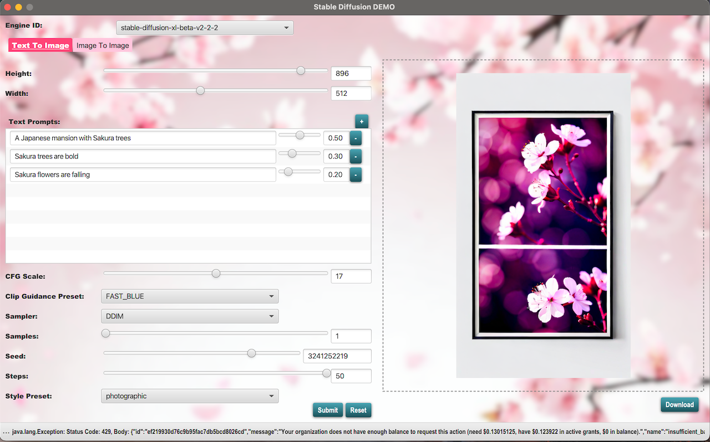

# SDUI4J - Stable Diffusion User Interface for Java

SDUI4J (Stable Diffusion User Interface for Java) is a standalone Graphic User Interface (GUI) program designed to
showcase the capabilities of Stable Diffusion, a powerful text-to-image model. Built using Java, JavaFX, and RESTful
APIs, SDUI4J provides an intuitive platform for interacting with Stable Diffusion.



## Features

- Text-to-Image Conversion: Easily generate images from textual descriptions via [Stability AI](https://stability.ai).
- Image-to-Image Conversion: Easily generate images from a given image via [Stability AI](https://stability.ai).
- User-Friendly Interface: Intuitive GUI for seamless interaction with the text-to-image and image-to-image conversion processes.
- Java-Based Implementation: Built entirely in Java, ensuring platform independence and ease of deployment.
- Utilization of JavaFX: Utilizes JavaFX for creating modern and intuitive user interfaces.
- Integration with RESTful APIs: Incorporates RESTful APIs for efficient communication and data exchange.

## Getting Started

To get started with SDUI4J, follow these simple steps:

- Clone the Repository: Clone the SDUI4J repository to your local machine using the following command:

```bash
git clone https://github.com/your-username/sdui4j.git
```

- Register at [Stability AI](https://stability.ai) and retrieve an API key.

- Save the API key in either Environment Variable or a dedicated properties file `sdui4j.properties` in the same folder of the program.

- Run the Program: By gradle, execute the application to launch the SDUI4J interface.

```bash
./gradlew run
```

## Usage
Once the program is running, you can:

## License
SDUI4J is licensed under the [MIT License](./LICENSE).

## References

- [JavaFX](https://openjfx.io/)
- [FXML Tutorial](https://docs.oracle.com/javafx/2/get_started/fxml_tutorial.htm)
- [Stability AI](https://stability.ai/)
- [FontAwesome](https://github.com/creationix/font-awesome/blob/master/FontAwesome.ttf)

## Contact
For any inquiries or feedback, feel free to contact me at [tekichan@gmail.com](mailto:tekichan@gmail.com)
